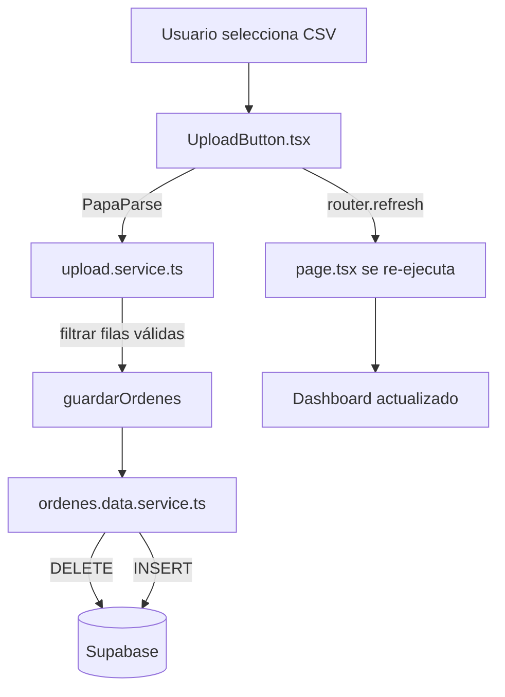
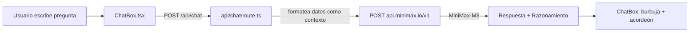
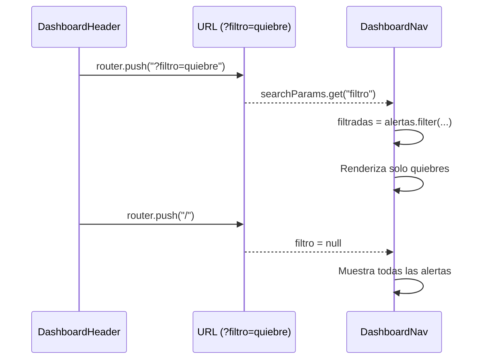
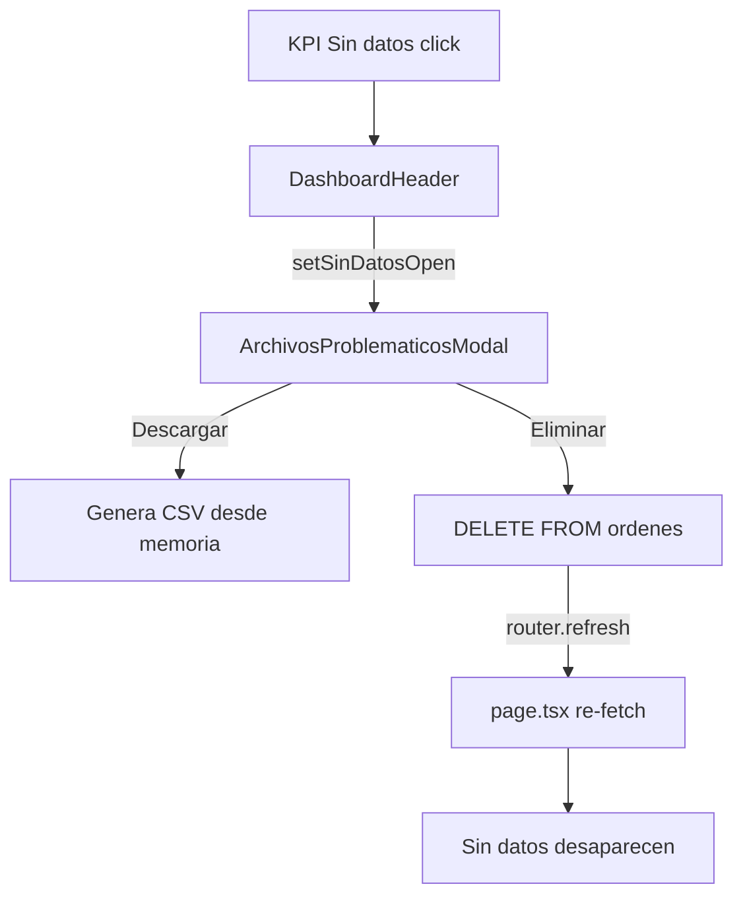
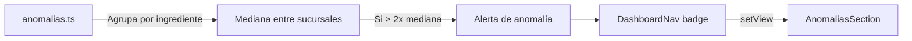
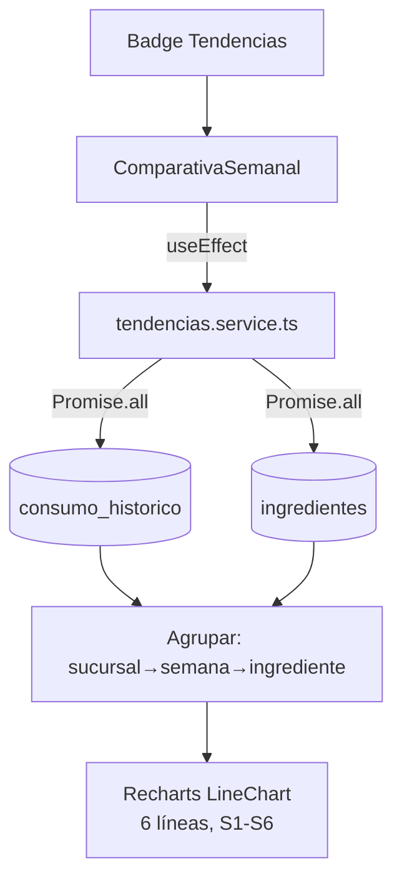
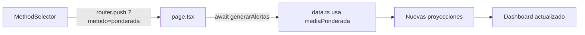
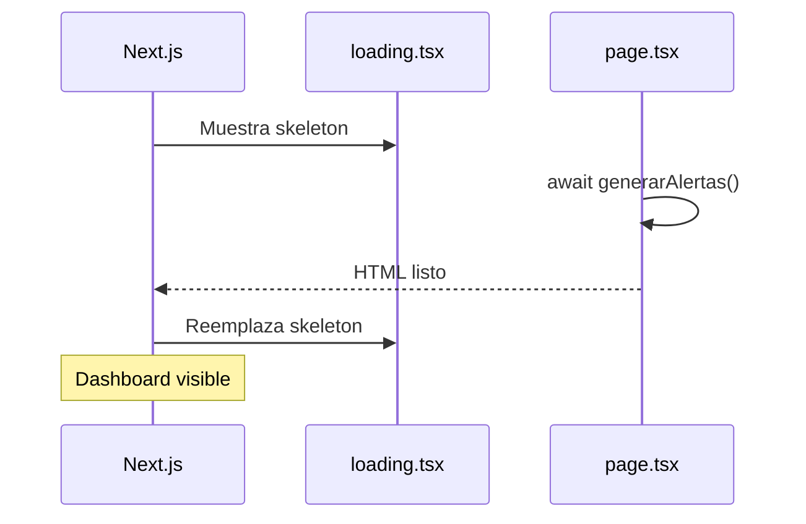

# 🔄 Flujo de Datos — Barrio Pizza

## Flujo principal (lectura)

```mermaid
flowchart TD
    A[Usuario navega a /] --> B[page.tsx<br/>Server Component]
    B -->|await generarAlertas| C[data-server.ts]
    C -->|Promise.all| D1[ingredientes]
    C -->|Promise.all| D2[consumo_historico]
    C -->|Promise.all| D3[inventario]
    C -->|Promise.all| D4[ordenes]
    D1 & D2 & D3 & D4 --> E[data.ts<br/>LÓGICA PURA]
    E --> F[proyeccion.ts<br/>mediana/media/ponderada]
    E --> G[necesidad.ts<br/>calcularNecesidad]
    E --> H[anomalias.ts<br/>detectarAnomalias]
    F & G & H --> I[Alertas[]]
    I --> J[DashboardHeader<br/>KPIs + filtros]
    I --> K[DashboardNav<br/>Badges + vistas]
    I --> L[ChatBox<br/>chat IA]
    J --> M[SucursalPanel]
    K --> M
    M --> N[Gráfico + Tabla]
```

## Flujo de upload (escritura)



## Flujo del chatbot



## Comunicación entre componentes (filtro vía URL)



## Flujo de "Sin datos" (modal)



## Flujo de anomalías



## Flujo de tendencias S1-S6



## Flujo de cambio de método



## Flujo de carga inicial


